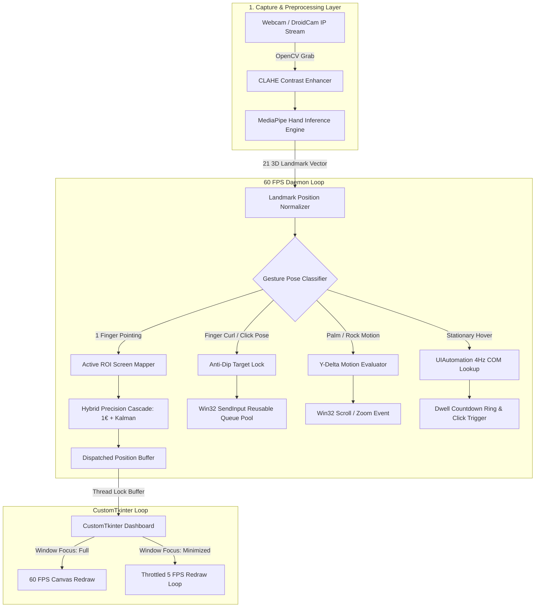

# 📘 AI Gesture Mouse v5.0 — Comprehensive Project & Architecture Documentation

Welcome to the **AI Gesture Mouse v5.0** codebase! This document provides an end-to-end guide designed to help new team members and developers quickly understand the project's goals, underlying technologies, software architecture, file responsibilities, gesture controls, and execution instructions.

---

## 📸 Project Interface & Visual Sign Guide

### 🖼️ Master Hand Gesture Signs Poster
Below is the visual sign gesture guide showing exact hand shapes for controlling the virtual mouse:


### 💻 Live Application UI Dashboard


---

## 📌 1. Project Overview & Core Mission

**AI Gesture Mouse v5.0** is an open-source, touchless human-computer interface (HCI) application that turns any standard webcam or IP camera feed into a high-precision virtual mouse. 

### Key Capabilities:
- **Jitter-Free Tracking**: Dual-stage filtering cascade combining **One Euro Filter** (adaptive cutoff frequency for static stillness) and **Kalman Filter** (predictive smooth trajectory).
- **Sub-Millisecond Processing**: Multi-threaded architecture that decouples 60 FPS gesture inference from Tkinter GUI rendering.
- **Kernel-Level Input Injection**: Uses Win32 `SendInput` C-types API to interact with UAC-elevated windows, Task Manager, and full-screen games.
- **Background Persistence**: Minimizes window redrawing overhead (throttling GUI to 5 FPS) while maintaining **uninterrupted 60 FPS mouse control** when minimized.

---

## 🛠️ 2. Technology Stack Breakdown

| Technology Layer | Library / Module | Specific Role & Function |
|---|---|---|
| **Programming Language** | `Python 3.8+` | Core application logic and async threading runtime |
| **Computer Vision** | `OpenCV (cv2)` | Frame acquisition, color conversions, CLAHE contrast enhancement, overlay drawing |
| **Hand Tracking AI** | `MediaPipe Hands` | 21 3D hand landmark detection and skeletal feature extraction |
| **GUI Framework** | `CustomTkinter` & `Pillow` | Modern dark-themed dashboard, control toggles, sliders, and camera feed display |
| **OS Kernel Integration** | `ctypes` & `ctypes.wintypes` | Direct C-level Win32 `SendInput` system calls for mouse clicks and movements |
| **Timer Precision** | `winmm.dll (timeBeginPeriod)`| Boosts Windows system timer resolution from 15.6ms to 1.0ms for sub-ms sleep precision |
| **UI Automation** | `uiautomation` | Queries Windows Accessibility COM tree for Dwell Click auto-targeting |
| **Concurrency Engine** | `threading` & `queue` | Multi-threaded background engine, camera scanner, and reusable click worker pool |
| **Data Analytics & Plotting**| `NumPy` & `Matplotlib` | Empirical benchmark analysis, academic paper figures, and progress chart generation |

---

## 💻 3. Step-by-Step Instructions: How to Run the Code

### Prerequisites
- **Operating System**: Windows 10 or Windows 11
- **Python**: Version 3.8 or higher installed — [Download Python](https://www.python.org/downloads/)
- **Camera**: Built-in webcam, USB camera, or mobile device streaming via DroidCam over Wi-Fi.

### Step 1: Open Workspace Directory
Open PowerShell or Command Prompt in the repository folder:
```powershell
cd path\to\Gesture_Mouse
```

### Step 2: Install Required Dependencies
Install all required Python packages:
```bash
pip install opencv-python mediapipe pyautogui customtkinter pillow numpy matplotlib uiautomation
```

### Step 3: Launch the Application
Run the main script to open the application GUI:
```bash
python main.py
```

### Step 4: Connecting Mobile / IP Camera (Optional)
If using DroidCam over Wi-Fi:
1. Launch DroidCam app on your phone.
2. In the AI Gesture Mouse UI, click **⚙ Settings** and select **IP Stream**.
3. Enter your phone's IP video stream URL (e.g., `http://192.168.1.50:4747/video`).

---

## 🧩 4. File-by-File Breakdown ("Which File Does What")

To navigate the codebase efficiently, here is a detailed breakdown of each file in the repository:

### 1. [`main.py`](file:///c:/Users/shaik/Gesture_Mouse/main.py) — Application Entry Point
- **Role**: Simple launcher for the application.
- **Functionality**: Instantiates `ModernGestureGUI` from `gui.py` and starts the Tkinter main event loop (`app.mainloop()`).

### 2. [`gui.py`](file:///c:/Users/shaik/Gesture_Mouse/gui.py) — User Interface & Control Dashboard
- **Role**: Manages the graphical interface built with CustomTkinter.
- **Key Responsibilities**:
  - Renders top title bar, status indicators, live camera feed canvas, and collapsible control panel.
  - Houses feature toggles (Cursor Tracking, Left/Right Click, Scroll, Zoom, Pinky Close, Dwell Click, Mirror Camera, CLAHE Booster).
  - Includes interactive sliders for One Euro Smoothness, ROI Scale, and Scroll Speed.
  - Implements **smart window throttling**: when the window is minimized or hidden, GUI canvas updates drop to 5 FPS to save CPU, while the underlying background gesture engine maintains uninterrupted 60 FPS tracking.
  - Spawns background camera scanning thread to discover active webcams without UI freezes.
  - Invokes Win32 `timeBeginPeriod(1)` on startup to guarantee 1.0ms timer precision across Windows.

### 3. [`gesture_engine.py`](file:///c:/Users/shaik/Gesture_Mouse/gesture_engine.py) — Core 60 FPS AI Processing Engine
- **Role**: The main processing brain running on a dedicated daemon thread (`threading.Thread`).
- **Key Responsibilities**:
  - Captures frames asynchronously from OpenCV camera feed or IP stream.
  - Applies CLAHE (Contrast Limited Adaptive Histogram Equalization) for dark environment luminance boosting.
  - Feeds frames to MediaPipe Hands model (`model_complexity=0` for maximum FPS).
  - Extracts 21 3D landmark points and maps normalized coordinates to screen space ROI zone.
  - Applies 2-stage **Hybrid Precision Filter**:
    - *One Euro Filter*: Dampens micro-tremors when static, reducing cursor jitter to `<0.1px`.
    - *Kalman Filter*: Eliminates latency during fast hand movements.
  - **Pose Classification Engine**:
    - **1 Finger (Index)** ➔ Move Cursor
    - **Pinch (Thumb+Index)** ➔ Drag & Drop
    - **Peace Sign (Index+Middle)** ➔ Left Click
    - **L-Shape (Thumb+Index)** ➔ Right Click
    - **Thumb Only** ➔ Double Click
    - **Open Palm (5 Extended)** ➔ Scroll Up/Down
    - **Rock Sign (Index+Pinky)** ➔ Zoom In/Out
    - **Pinky Extended (Shaka)** ➔ Close Active Window (`Alt+F4`)
    - **Dwell Stationary Hover** ➔ Auto Left Click via `uiautomation`
  - Implements **Anti-Dip Pose Lock**: Locks cursor position immediately when finger curl is detected to prevent accidental pointer drift during clicks.

### 4. [`mouse_controller.py`](file:///c:/Users/shaik/Gesture_Mouse/mouse_controller.py) — Kernel-Level Win32 Mouse Driver
- **Role**: Low-level Win32 OS interaction interface.
- **Key Responsibilities**:
  - Wraps Windows C-types `SendInput()` API (`MOUSEEVENTF_MOVE`, `MOUSEEVENTF_ABSOLUTE`, `MOUSEEVENTF_VIRTUALDESK`).
  - Converts screen pixel coordinates into normalized 0–65535 Win32 coordinates.
  - Includes **Anti-OS-Flooding Filter**: suppresses redundant coordinate dispatches if rounded pixel location hasn't changed.
  - Houses a **Reusable Worker Queue Daemon Thread** (`_up_event_worker`): dispatches non-blocking click release (`UP`) events with exact hardware delays, eliminating OS thread creation overhead per click.

### 5. [`create_gesture_guide_image.py`](file:///c:/Users/shaik/Gesture_Mouse/create_gesture_guide_image.py) — Visual Poster Generator
- **Role**: Automated Pillow (`PIL`) script to build the reference visual poster (`assets/gesture_guide_v5.jpg`).

### 6. Research & Plotting Tools
- [`plot_daily_progress_graph.py`](file:///c:/Users/shaik/Gesture_Mouse/plot_daily_progress_graph.py): Plots day-by-day project metrics (`daily_progress_chart.png`).
- [`plot_project_results.py`](file:///c:/Users/shaik/Gesture_Mouse/plot_project_results.py): Generates academic 4-panel evaluation dashboards (`project_results_dashboard.png`, `paper_accuracy_loss_section.png`).
- [`plot_v4_updates.py`](file:///c:/Users/shaik/Gesture_Mouse/plot_v4_updates.py): Plots anti-dip target lock and UI component tracking metrics (`v4_improvements.png`).

---

## 🖐️ 5. Hand Gesture Control Suite Reference

Below is the complete gesture mapping table:

| Gesture Name | Hand Pose Sign | Primary Action | Technical Behavior & Safety Buffers |
|---|---|---|---|
| **Move Cursor** | ☘️ **1 Finger Extended** (Index Only) | Pointer Movement | Moves pointer. Strictly single-finger rule prevents accidental moves during click poses. |
| **Drag & Drop** | 🤏 **Pinch & Hold** (Index + Thumb Touch) | Drag & Drop | Pinch to grab window/file with 1.75x hysteresis release buffer. Open fingers to Drop. |
| **Left Click** | ✌️ **Peace Sign** (Index + Middle) | Single Left Click | Non-blocking kernel `SendInput` left click with 5-frame debounce filter. |
| **Right Click** | 👆 **L-Shape** (Thumb + Index) | Context Right Click | Context menu trigger with instant cursor coordinate freezing. |
| **Double Click** | 👍 **Thumb Only** | Double Click | Fires rapid sequential left clicks with a 30ms hardware pause. |
| **Scroll Up / Down**| 🖐 **Open Palm** (5 Extended) | Vertical Scroll | Evaluates Y-delta: slide hand **UP** for Scroll Up, **DOWN** for Scroll Down. |
| **Zoom In / Out** | 🤘 **Rock Sign** (Index + Pinky) | Canvas / App Zoom | Slide hand **UP** for Zoom In (`Ctrl + =`), **DOWN** for Zoom Out (`Ctrl + -`). |
| **Close Window** | 🤙 **Pinky Extended** (Shaka Sign) | Close App Window | 18-frame (~300ms) safety hold dispatches system `Alt + F4` shortcut. |
| **Smart UI Hover** | 🕐 **Hover Cursor 3s on UI Element** | Auto Left Click | Queries Windows UIAutomation Accessibility tree; immune to hand tremors. |

---

## 🏗️ 6. System Architecture & Signal Flow Pipeline



---

## 💡 Summary Checklist for New Team Members

1. Run `pip install opencv-python mediapipe pyautogui customtkinter pillow numpy matplotlib uiautomation`.
2. Execute `python main.py` to start the application.
3. Test hand gestures using the **Master Hand Gesture Signs Poster** above.
4. If modifying click logic, edit [`mouse_controller.py`](file:///c:/Users/shaik/Gesture_Mouse/mouse_controller.py).
5. If adding or retuning hand signs, edit [`gesture_engine.py`](file:///c:/Users/shaik/Gesture_Mouse/gesture_engine.py).
6. If modifying dashboard controls or sliders, edit [`gui.py`](file:///c:/Users/shaik/Gesture_Mouse/gui.py).
