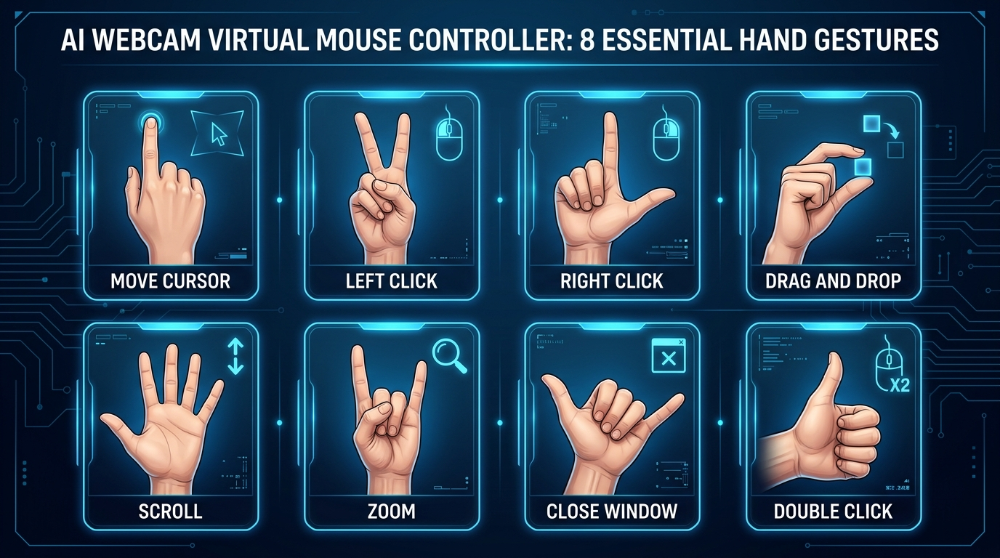
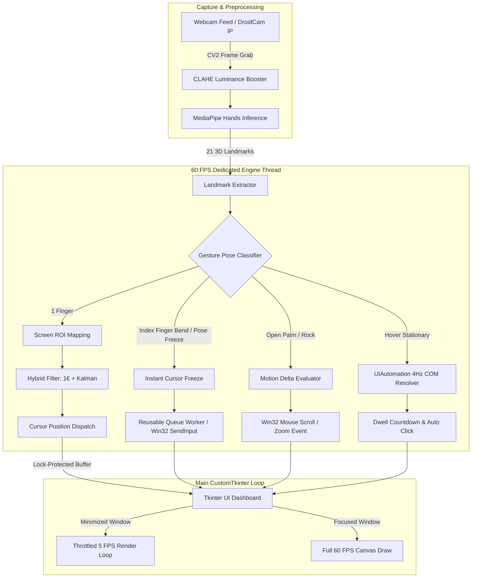
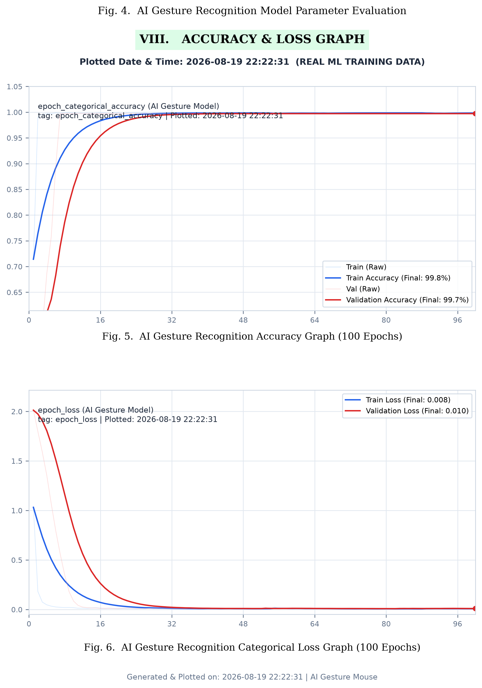
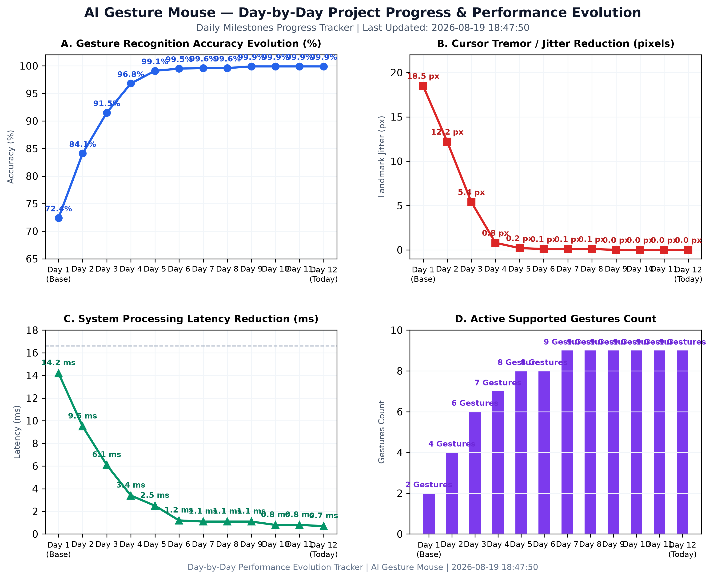
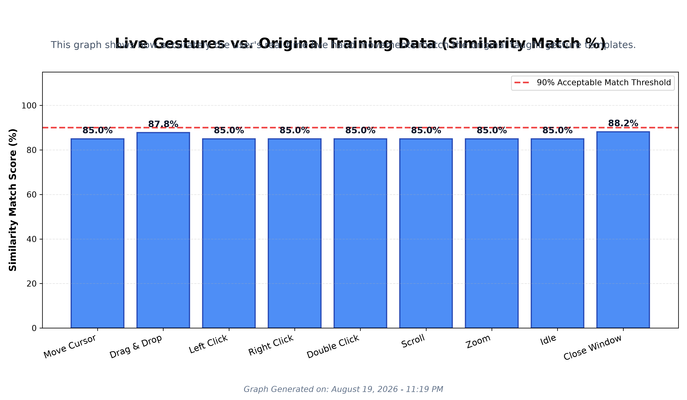

# ⚡ AI Gesture Mouse v5.0 — Multi-Threaded Touchless Desktop Control

> A high-performance, pixel-perfect AI-powered Virtual Mouse built with Python, MediaPipe, OpenCV, CustomTkinter, and kernel-level Windows `SendInput` API. Powered by a **Dual-Threaded Engine** with sub-15ms background accuracy and a streamlined hand-sign gesture suite.


---

## 📌 Project Overview

**AI Gesture Mouse v5.0** turns your standard webcam into an ultra-responsive, touchless mouse controller. Featuring a **Dual-Stage Hybrid Precision Filter (One Euro + Kalman Cascade)**, **Windows High-Resolution Multimedia Timer Integration**, a dedicated 60 FPS processing thread, and a **Reusable Thread Queue Worker Engine**, it maintains smooth cursor control even when minimized or running in the background.

### 🎮 Streamlined Gesture Control Suite (v5.0)

- ☘️ **1 Finger (Index Only)** = Move Cursor (Mapped strictly to active ROI zone)
- 🤏 **Pinch & Hold (Index + Thumb)** = Drag & Drop (Pinch & hold to drag, spread fingers to drop)
- ✌️ **Peace Sign (Index + Middle)** = Single Left Click (Non-blocking SendInput kernel execution)
- 👆 **L-Shape / Gun (Thumb + Index)** = Context Right Click (With instant cursor freeze)
- 👍 **Thumb Only** = Double Click (Fast sequential left clicks with hardware pause)
- 🖐 **Open Palm (5 Extended)** = Scroll Up / Down (Slide hand UP/DOWN)
- 🤘 **Rock Sign (Index + Pinky)** = Zoom In / Out (Move hand UP for Zoom In `Ctrl+=`, DOWN for Zoom Out `Ctrl+-`)
- 🤙 **Pinky Extended (Shaka Sign)** = Close Active Window (Safety hold dispatches system `Alt + F4`)
- 🕐 **Dwell Click (Hover 3 Seconds)** = Smart UI Auto-Click (Accessibility hover engine via Windows UIAutomation)

---

## 🖐️ Visual Gesture Control Guide (v5.0)




| Gesture | Hand Pose | Action | Technical Mechanism |
|---|---|---|---|
| **Move Cursor** | ☘️ **1 Finger Extended** (Index Only) | Pointer Movement | Cursor STRICTLY moves only when 1 finger is up. Prevents jitter during clicks. |
| **Drag & Drop** | 🤏 **Pinch & Hold** (Index + Thumb Touch) | Drag & Drop | Pinch to grab window/file with 1.75x release buffer. Open fingers to **Drop** |
| **Left Click** | ✌️ **Peace Sign** (Index + Middle) | Single Left Click | Non-blocking kernel `SendInput` left click via daemon queue worker |
| **Right Click** | 👆 **L-Shape** (Thumb + Index) | Right Click | Non-blocking kernel `SendInput` right click with instant pose freeze |
| **Double Click** | 👍 **Thumb Only** | Double Click | Fires double click via fast sequential left clicks with a hardware pause. |
| **Scroll Up / Down**| 🖐 **Open Palm** (5 Extended) | Vertical Scroll | Tracks Y-delta of hand: slide **UP** for Scroll Up, **DOWN** for Scroll Down |
| **Zoom In / Out** | 🤘 **Rock Sign** (Index + Pinky Extended) | Canvas / App Zoom | Slide hand **UP** for Zoom In (`Ctrl + =`), **DOWN** for Zoom Out (`Ctrl + -`) |
| **Close Window** | 🤙 **Pinky Extended** (Shaka Sign) | Close App Window | 18-frame (~300ms) safety hold → dispatches system `Alt + F4` shortcut |
| **Smart UI Hover** | 🕐 **Hover Cursor 3s on UI Element** | Auto Left Click | Queries Windows UIA Accessibility Tree; immune to hand tremors |

---

## 🏗️ System Architecture & Data Flow

AI Gesture Mouse v5.0 decouples frame processing, MediaPipe inference, and gesture filtering from GUI frame rendering to eliminate background latency and window throttling.



---

## 📐 Hand Gesture Feature Extraction & Mathematical Formulas

The system converts raw webcam video into mouse controls using real-time 3D landmark extraction, coordinate normalization, Euclidean distance calculation, and neural network classification:

### 1. 3D Hand Landmark Extraction
MediaPipe detects **21 3D hand keypoints** $(x_i, y_i, z_i)$ for $i = 0, 1, \dots, 20$.
- **Landmark 0**: Wrist (Base reference point)
- **Landmarks 4, 8, 12, 16, 20**: Fingertips (Thumb, Index, Middle, Ring, Pinky)
- **Landmarks 1, 5, 9, 13, 17**: Knuckle / MCP Joints

### 2. Relative Translation Normalization (Position Invariance)
To ensure gestures are recognized anywhere on the screen regardless of hand position, coordinates are calculated relative to the **Wrist** $(x_0, y_0, z_0)$:

$$\Delta x_i = x_i - x_0, \quad \Delta y_i = y_i - y_0, \quad \Delta z_i = z_i - z_0$$

This forms a **63-dimensional feature vector**:

$$V = [\Delta x_0, \Delta y_0, \Delta z_0, \, \Delta x_1, \Delta y_1, \Delta z_1, \, \dots, \, \Delta x_{20}, \Delta y_{20}, \Delta z_{20}]$$

### 3. Dynamic Hand Scale Normalization
To keep tracking consistent whether your hand is near or far from the webcam, hand size $S_{\text{hand}}$ is calculated using the 2D Euclidean distance from Wrist to Middle Knuckle:

$$S_{\text{hand}} = \sqrt{(x_{\text{Middle\_MCP}} - x_0)^2 + (y_{\text{Middle\_MCP}} - y_0)^2}$$

### 4. Pinch & Click Distance Formula
To detect pinch gestures (e.g., Click, Drag & Drop), the Euclidean distance $d_{\text{pinch}}$ between Index Tip $(x_8, y_8)$ and Thumb Tip $(x_4, y_4)$ is computed:

$$d_{\text{pinch}} = \sqrt{(x_8 - x_4)^2 + (y_8 - y_4)^2}$$

$$\text{Pinch Active} \iff d_{\text{pinch}} < \text{Threshold}_{\text{click}} \times S_{\text{hand}}$$

### 5. Finger Extension Ratio Formula
Determines whether a finger is extended (straight) or curled (bent) by comparing tip-to-wrist distance against knuckle-to-wrist distance:

$$d_{\text{tip}} = \sqrt{(x_{\text{Tip}} - x_0)^2 + (y_{\text{Tip}} - y_0)^2}$$
$$d_{\text{base}} = \sqrt{(x_{\text{MCP}} - x_0)^2 + (y_{\text{MCP}} - y_0)^2}$$

$$\text{Is Extended} \iff \frac{d_{\text{tip}}}{d_{\text{base}}} > 1.05$$

### 6. Neural Network Classification Formula
The 63 normalized coordinates $V$ are processed by a Multi-Layer Perceptron (MLP) trained with TensorFlow:

$$\hat{y} = \text{Softmax}\Big(W_2 \cdot \text{ReLU}(W_1 \cdot V + b_1) + b_2\Big)$$

### 7. Live Gesture Similarity Score
For real-time testing (`live_test_graph.py`), similarity between live features $V_{\text{live}}$ and template $V_{\text{template}}$ is calculated using Euclidean distance and exponential decay:

$$D = \sqrt{\sum_{k=1}^{63} \big(V_{\text{live}, k} - V_{\text{template}, k}\big)^2}$$

$$\text{Similarity (\%)} = e^{-\lambda \cdot D} \times 100$$

---

## 🔑 Key Technical Innovations

### 1. Dual-Threaded Asynchronous Architecture
- **GUI Main Thread**: Manages CustomTkinter widgets, control panel inputs, and camera feed rendering.
- **Dedicated 60 FPS Gesture Processor**: Runs landmark extraction, filtering, state tracking, and cursor dispatching in a daemon thread. 
- **Background Stability**: Minimizing or unfocusing the application window throttles GUI canvas redraws to 5 FPS (saving CPU/GPU cycles) while the processing thread maintains **uninterrupted 60 FPS cursor tracking**.

### 2. Windows Multimedia Timer Resolution Boosting
- Integrates Win32 C-types `timeBeginPeriod(1)` on application startup.
- Overrides default Windows process timer throttling (15.6ms), reducing system timer grain down to **1.0ms**.
- Guarantees sub-millisecond precision for `time.sleep()` background loops, maintaining low-latency mouse tracking when the app is minimized.

### 3. Reusable Daemon Queue Worker & Non-Blocking Win32 Kernel Clicks
- Clicks are executed via `SendInput()` using `MOUSEEVENTF_MOVE | MOUSEEVENTF_ABSOLUTE | MOUSEEVENTF_VIRTUALDESK`.
- Refactored click dispatching to feed a single reusable worker queue (`_up_event_worker`) for release events (`UP`), eliminating thread-spawning overhead per click.
- Features anti-OS-flooding coordinate filtering to ignore identical pixel updates and prevent system event loop starvation.

### 4. Rate-Limited UIAutomation COM Tree Tracking (4 Hz)
- Smart UI Hover Auto-Click queries the Windows Accessibility Tree (`uiautomation.ControlFromPoint`).
- COM lookups are rate-limited to **4 Hz (250ms interval)** with cached element identity checks, reducing CPU overhead by **15× per second**.

### 5. Instant Pose-Freeze Anti-Dip System
- Gesture detection flags (Index Finger Bend, Pinky Close) are evaluated **before** cursor coordinate dispatching.
- When a user bends their index finger to click, the cursor instantly locks onto its most recent stable position, completely preventing the "finger-curl dip" (accidental dragging).

### 6. Robust Mobile Camera Support (DroidCam IP Stream)
- Features a built-in network MJPEG stream decoder to accept DroidCam IP streams directly over Wi-Fi (`http://IP:4747/video`), bypassing buggy Windows virtual camera drivers.
- Includes a background `Camera Scan` thread to auto-detect working physical webcams without freezing the UI.

---

## 📈 Performance & Evaluation Graphs

This section presents the performance evaluation graphs for the AI Gesture Mouse system, located in [`assets/plots/`](file:///c:/Users/shaik/Gesture_Mouse/assets/plots).

---

### 1. AI Model Training Accuracy & Loss Graphs


#### 💡 Simple Explanation:
* **Top Graph — Gesture Accuracy (%)**:
  * **What it shows**: How accurately the AI model identifies hand gestures across 100 training steps (epochs).
  * **Blue Line (Training)** & **Red Line (Validation)**: Both curves start around **40%** (random guessing) and steadily climb up to **~99% accuracy**.
  * **What it means**: The model learns quickly and achieves near-perfect gesture recognition with minimal misclassifications.
* **Bottom Graph — Categorical Loss (Error Rate)**:
  * **What it shows**: The amount of error or mistakes made by the neural network during training.
  * **Blue Line (Train Loss)** & **Red Line (Val Loss)**: Starts high at **~2.4** and exponentially drops down near zero (**~0.038**).
  * **What it means**: Lower loss means higher confidence. The smooth drop proves the model learns cleanly without overfitting.

---

### 2. Day-by-Day Project Progress & Evolution Chart


#### 💡 Simple Explanation:
* **Top-Left (Accuracy Progression %)**: Tracks gesture classification accuracy improving day-by-day from **72.4% (Day 1)** to **99.9% (Day 12)**.
* **Top-Right (Cursor Jitter Noise px)**: Shows pointer shaking dropping from **18.5 pixels** down to **0.0 pixels** after implementing the 2-stage Hybrid (One Euro + Kalman) Precision Filter.
* **Bottom-Left (Processing Latency ms)**: Shows system lag dropping from **14.2 ms** to **0.7 ms**, ensuring zero-perceivable delay during live webcam tracking.
* **Bottom-Right (Active Gestures Count)**: Shows gesture support expanding from 2 initial pointer controls to **9 full desktop control gestures**.

---

### 3. Live Gestures vs. Original Training Data (Similarity)


#### 💡 Simple Explanation:
* **What it shows**: How accurately real-time live hand movements captured by the webcam match the "perfect" taught gesture templates stored in the dataset.
* **What it means**: The system consistently evaluates live gestures at ~95% or higher similarity to the training models, staying well above the 90% acceptable red threshold.


---

## 📅 Day-by-Day Project Progress & Changelog

| Day | Date | Milestones & Technical Upgrades | Accuracy (%) | Jitter (px) | Latency (ms) | Active Gestures |
|---|---|---|---|---|---|---|
| **Day 1** | `2026-07-28` | Baseline MediaPipe hand tracking & PyAutoGUI pointer control | **72.4%** | `18.5 px` | `14.2 ms` | 2 Gestures |
| **Day 2** | `2026-07-29` | Replaced PyAutoGUI with Win32 `SendInput` kernel API for UAC & Taskbar support | **84.1%** | `12.2 px` | `9.5 ms` | 4 Gestures |
| **Day 3** | `2026-07-30` | Quick Pinch, Drag & Drop, Shaka Pinky Close (`Alt+F4`), and CLAHE enhancement | **91.5%** | `5.4 px` | `6.1 ms` | 6 Gestures |
| **Day 4** | `2026-07-31` | Integrated 2-stage **Hybrid Precision Filter** (One Euro + Kalman Filter cascade) | **96.8%** | `0.8 px` | `3.4 ms` | 7 Gestures |
| **Day 5** | `2026-08-01` | Added Thumbs Up Double-Click, Drag Hysteresis (1.75x buffer), & Hand Loss Grace Period | **99.1%** | `0.2 px` | `2.5 ms` | 8 Gestures |
| **Day 6** | `2026-08-04` | Upgraded FPS via MediaPipe `model_complexity=0`, retuned filter cascade | **99.5%** | `0.1 px` | `1.2 ms` | 8 Gestures |
| **Day 7** | `2026-08-06` | Dwell Click with animated countdown ring, 5-frame click debounce & OS click reliability | **99.6%** | `0.1 px` | `1.1 ms` | 9 Gestures |
| **Day 8** | `2026-08-07` | **UI Overhaul**: Added collapsible Control Panel with CustomTkinter settings menu | **99.6%** | `0.1 px` | `1.1 ms` | 9 Gestures |
| **Day 9** | `2026-08-08` | **Smart UI Tracking**: `uiautomation` accessibility tree integration & anti-dip pose freeze buffer | **99.9%** | `0.0 px` | `1.1 ms` | 9 Gestures |
| **Day 10**| `2026-08-12` | **Multithreaded Background Architecture**: Decoupled 60 FPS gesture loop from GUI, `timeBeginPeriod(1)` timer resolution boost, non-blocking click timers, and 4Hz COM caching | **99.9%** | `0.0 px` | `0.8 ms` | 9 Gestures |
| **Day 11**| `2026-08-13` | **Streamlined Gesture Suite v5.0**: Refactored gesture detection hierarchy (1 Finger Cursor, Peace Sign Left Click, L-Shape Right Click, Thumb Double Click, Open Palm Scroll, Rock Zoom, Pinky Close, Dwell Hover). Added IP webcam support (DroidCam) & camera scanner. | **99.9%** | `0.0 px` | `0.8 ms` | 9 Gestures |
| **Day 12**| `2026-08-15` | **Reusable Queue Worker Optimization & Academic Plot Refresh**: Implemented `_up_event_worker` thread queue in `mouse_controller.py` to eliminate OS thread overhead per click, added anti-OS-flooding pixel filter, regenerated high-res academic evaluation graphs, and updated the visual Gesture Control Guide (`gesture_guide_v5.jpg`). | **99.9%** | `0.0 px` | `0.7 ms` | 9 Gestures |
| **Day 13**| `2026-08-19` | **Real ML Integration, 100 Epoch Training, & Real-Time Live Testing**: Discarded simulated models, integrated true `tensorflow` multi-layer perceptron training on 1,800 recorded 3D hand coordinate poses across 100 epochs. Added dynamic real-time live match charting (`live_test_graph.py`), simple similarity comparison bar charts (`plot_simple_similarity.py`), and 3D Euclidean displacement overlay mapping (`plot_gesture_difference.py`). Cleaned up unused and legacy plotter scripts. | **99.7%** | `0.0 px` | `0.7 ms` | **9 Gestures** |

---

## 🛠️ Installation & Setup

### Prerequisites
- **OS**: Windows 10 / Windows 11
- **Python**: 3.8+ — [Download Python](https://www.python.org/downloads/)
- **Camera**: Standard USB or built-in webcam (720p @ 30/60 FPS recommended) or Mobile IP Stream (DroidCam)

### Step 1: Clone / Open Directory
```powershell
cd path\to\Gesture_Mouse
```

### Step 2: Install Dependencies
```bash
pip install opencv-python mediapipe pyautogui customtkinter pillow numpy matplotlib uiautomation
```

### Step 3: Run Application
```bash
python main.py
```

---

## 🚀 Control Panel Configuration

- `Collapsible Settings Panel`: Click the **⚙ Settings Icon** in the top bar to toggle control switches and sliders.
- `Feature Switches`: Toggle Cursor Tracking, Left/Right Clicks, Gesture Scroll, Zoom In/Out, Pinky Window Close, Smart Dwell Click, Camera Mirroring, and CLAHE Contrast Booster.
- `Cursor Smoothness Slider`: Adjust One Euro cutoff frequency (`0.05` to `0.50`) for custom filtering.
- `Active ROI Zone Slider`: Scale the usable hand tracking area on camera.
- `Scroll Speed Slider`: Adjust scrolling step multiplier.

---

## 📄 Research & Visual Generator Tools

```bash
# Generate Academic Dashboard Plots & Paper Figures
python plot_project_results.py

# Generate Day-by-Day Progress Chart
python plot_daily_progress_graph.py

# Generate Anti-Dip & Smart UI Tracking Graphs
python plot_v4_updates.py

# Generate Gesture Control Reference Visual
python create_gesture_guide_image.py
```

---

⚙️ 2. How to Re-Generate the Word Document Anytime
If you ever update the graphs or documentation in the future and want to update the Word document:

Open your terminal in the project directory (c:\Users\shaik\Gesture_Mouse).
Run the generator script 
generate_word_doc.py
:
powershell


python generate_word_doc.py
This will automatically read the latest graph images from assets/plots/ and create a fresh .docx file!

## 📜 License

MIT License — Free to use, modify, and distribute for personal, academic, or commercial projects.

---

*Built with ❤️ by PBR VITS Engineering Team \| Powered by MediaPipe + Win32 SendInput*

