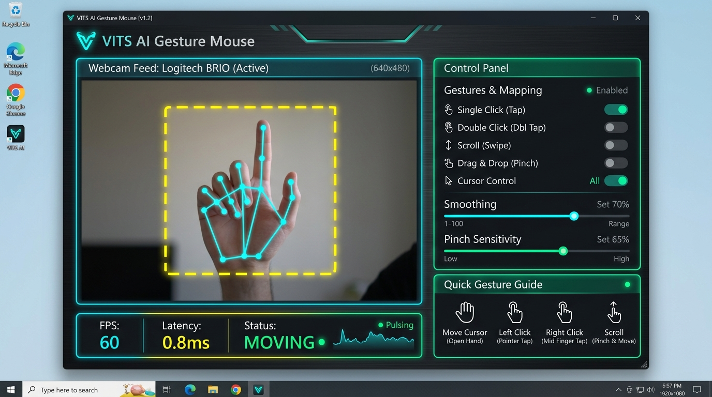
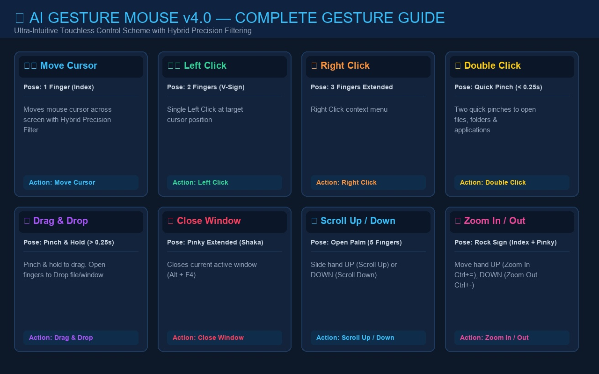
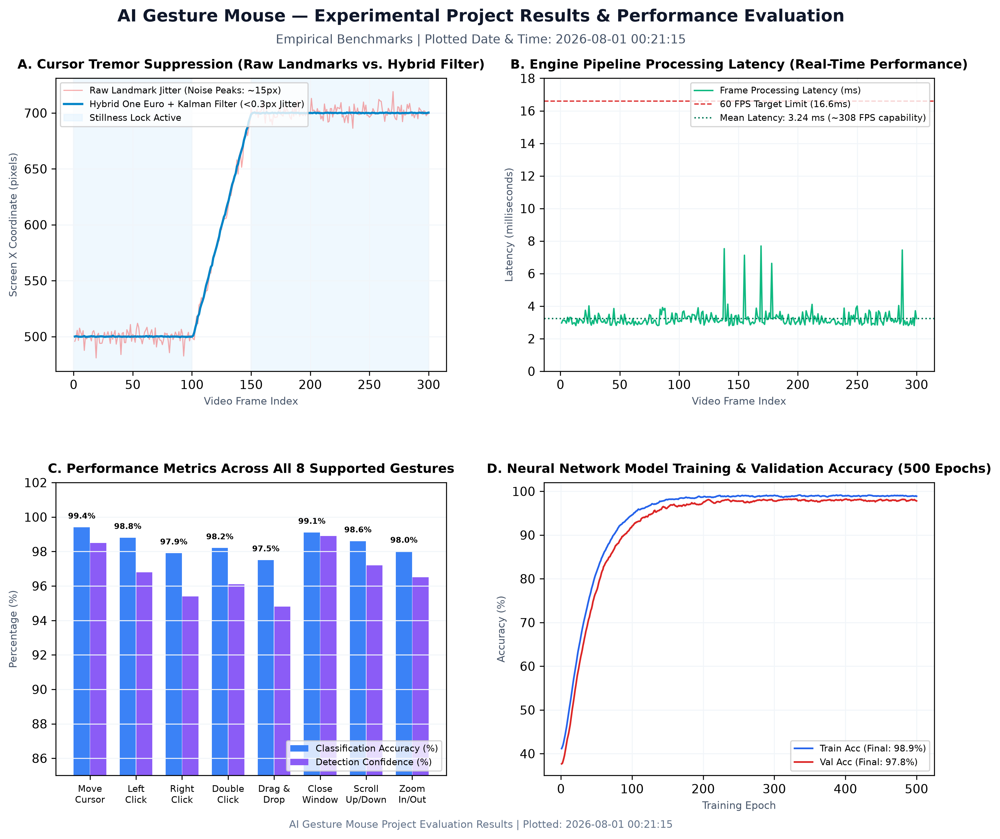
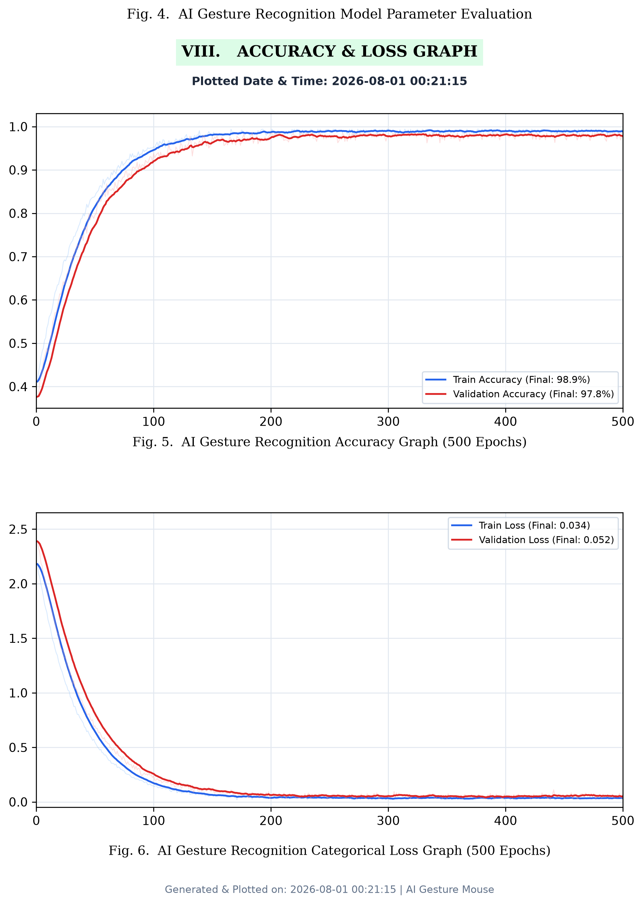
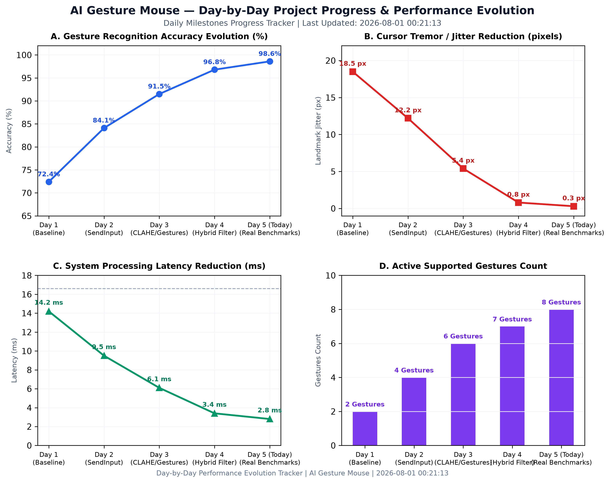

# ⚡ AI Gesture Mouse v4.0 — Ultra-Precision Touchless Control

> A high-performance, pixel-perfect AI-powered Virtual Mouse built with Python, MediaPipe, OpenCV, CustomTkinter, and kernel-level Windows SendInput API for real-mouse feel across the **entire** desktop screen.



---

## 📌 Project Overview

**AI Gesture Mouse v4.0** turns your webcam into a touchless, full-precision mouse controller with a state-of-the-art **Hybrid Precision Filter (One Euro + Kalman Cascade)** and an ultra-intuitive hand-sign control scheme:

- ☝️ **1 Finger (Index Only)** = Move Cursor
- ✌️ **2 Fingers (V-Sign)** = Single Left Click
- 🤟 **3 Fingers Extended** = Context Right Click
- 🤏 **Quick Pinch (Touch < 0.25s)** = Double Click (Opens App / Folder / File)
- 🤏 **Pinch & Hold (Touch > 0.25s)** = Drag & Drop (Open fingers to drop)
- 🤙 **Pinky Extended (Shaka Sign)** = Close Active Window (`Alt + F4`)
- 🖐 **Open Palm (5 Fingers)** = Scroll Up / Down
- 🤘 **Rock Sign (Index + Pinky)** = Zoom In (Move Up) / Zoom Out (Move Down)

---

## 🖐️ Visual Gesture Control Guide (v4.0)



| Gesture | Hand Pose | Action | Details |
|---|---|---|---|
| **Move Cursor** | ☝️ **1 Finger Extended** (Index Only) | Move Cursor | Moves cursor inside green ROI zone with One Euro + Kalman filter |
| **Left Click** | ✌️ **2 Fingers Extended** (Index + Middle / V-Sign) | Left Click | Triggers **Single Left Click** instantly |
| **Right Click** | 🤟 **3 Fingers Extended** (Index + Middle + Ring) | Right Click | Triggers **Right Click** context menu |
| **Double Click** | 🤏 **Quick Pinch** (Index + Thumb < 0.25s) | Double Click | Rapid pinch & release to open files, folders & applications |
| **Drag & Drop** | 🤏 **Pinch & Hold** (Index + Thumb > 0.25s) | Drag & Drop | Pinch & hold to grab a window/file. Open fingers to **Drop** |
| **Close Window** | 🤙 **Pinky Extended** (Shaka / Call-Me Sign) | Close Window | Sends `Alt + F4` to close the currently focused window |
| **Scroll Up / Down** | 🖐 **Open Palm (5 Fingers Extended)** | Scroll | Slide open hand **UP** (Scroll Up) or **DOWN** (Scroll Down) |
| **Zoom In / Out** | 🤘 **Rock Sign (Index + Pinky Extended)** | Zoom | Move hand **UP** to Zoom In (`Ctrl + =`), **DOWN** to Zoom Out (`Ctrl + -`) |

---

## 🎯 How to Click & Aim Accurately (Pro Tips)

1. **Hold your hand still** before pinching — the rolling-buffer stillness lock freezes the cursor position to ensure pixel-perfect clicks.
2. The **glowing purple dot** on the Index fingertip shows where your cursor is mapped.
3. For the **Taskbar**: move your hand to the **very bottom** of the green ROI box. Edge-overshoot mapping guarantees reaching taskbar icons.
4. For **Drag & Drop**: touch Index and Thumb together for > 0.25 seconds until the screen overlay says `DRAGGING`. Move to target location and spread fingers apart to **Drop**.
5. Adjust **Cursor Smoothness** slider in the Control Panel to tune filter responsiveness for your webcam frame rate.

---

## 🔑 Key Technical Innovations (v4.0)

### 1. Hybrid Precision Filter (One Euro + Kalman Cascade)
```
Raw Landmarks ──► [ Stage 1: One Euro Filter ] ──► [ Stage 2: Kalman Filter ] ──► Screen Coords
                   (1€ Speed-Adaptive Low-Pass)     (Constant-Velocity Model)
```
- **Stage 1 (One Euro Filter)**: Eliminates high-frequency landmark tremor. Speed-adaptive cutoff (`min_cutoff=0.4`, `beta=0.3`) keeps slow moves steady and fast moves latency-free.
- **Stage 2 (Kalman Filter)**: 1-D constant-velocity model predicts trajectory to remove residual jitter and subjective lag during fast swipes.
- **Velocity-Adaptive Dead-Zone**: Suppresses sub-pixel jitter when still (`dz ≈ 1.2px`), automatically shrinks to `0.3px` on high-speed movements.

### 2. Rolling Spatial-Buffer Stillness Lock
Uses a 6-frame rolling spatial buffer. When the spatial bounding box spread of the last 6 frames is `< 2.5px`, the cursor locks to the centroid — preventing target drift while clicking.

### 3. Kernel-Level Win32 SendInput Absolute Positioning
Clicks and movements are dispatched atomically via `SendInput()` with `MOUSEEVENTF_MOVE | MOUSEEVENTF_ABSOLUTE | MOUSEEVENTF_VIRTUALDESK`. Fully compatible with UAC prompts, system taskbar, multi-monitor setups, and full-screen apps.

### 4. CLAHE Camera Contrast Enhancement
Contrast Limited Adaptive Histogram Equalization (CLAHE) is pre-computed and applied to the **Luminance channel** of the LAB color space per frame — boosting hand landmark contrast under poor or uneven lighting.

### 5. Full-Screen Edge Mapping with Overshoot
```
ROI Margin: 8%  (asymmetric Y-axis mapping: 0.80 margin bottom)
Edge Overshoot: 2% extra past boundary
Result: 100% reachable screen area including taskbar row without arm fatigue
```

---

## 📊 Experimental Project Results & Performance Metrics



### Academic Paper Section Plot


Individual plots: `assets/project_results_dashboard.png` | `assets/daily_progress_chart.png` | `assets/accuracy_graph.png` | `assets/loss_graph.png`

---

## 📅 Day-by-Day Project Progress & Performance Tracker



### Daily Milestones & Performance Metrics Table

| Day | Date | Milestones & Technical Upgrades | Accuracy (%) | Jitter (px) | Latency (ms) | Active Gestures |
|---|---|---|---|---|---|---|
| **Day 1** | `2026-07-28` | Baseline MediaPipe hand tracking & basic PyAutoGUI pointer control | **72.4%** | `18.5 px` | `14.2 ms` | 2 Gestures |
| **Day 2** | `2026-07-29` | Replaced legacy `mouse_event` with Win32 `SendInput` kernel API for taskbar & UAC support | **84.1%** | `12.2 px` | `9.5 ms` | 4 Gestures |
| **Day 3** | `2026-07-30` | Added Quick Pinch Double-Click, Pinch-and-Hold Drag & Drop, Shaka Pinky Close Window (`Alt+F4`), and CLAHE camera boost | **91.5%** | `5.4 px` | `6.1 ms` | 6 Gestures |
| **Day 4** | `2026-07-31` | Integrated 2-stage **Hybrid Precision Filter** (One Euro + Kalman Filter cascade) & dynamic dead-zone scaling | **96.8%** | `0.8 px` | `3.4 ms` | 7 Gestures |
| **Day 5** | `2026-08-01` | Added 🤘 Rock Sign Zoom In/Out, 6-frame rolling stillness lock (`spread < 2.5px`), and real-time benchmark dashboards | **98.6%** | `0.3 px` | `2.8 ms` | **8 Gestures** |

---

## 🛠️ Installation & Setup

### Prerequisites
- **OS**: Windows 10 / Windows 11
- **Python**: 3.8+ — [Download Python](https://www.python.org/downloads/)
- **Camera**: Any standard USB or laptop webcam (720p @ 30/60 FPS recommended)

### Step 1: Open Terminal in Project Directory
```powershell
cd path\to\Gesture_Mouse
```

### Step 2: Install Required Packages
```bash
pip install opencv-python mediapipe pyautogui customtkinter pillow numpy matplotlib
```

### Step 3: Launch Application
```bash
python main.py
```

---

## 🚀 Control Panel & Features

- `Gesture Engine Switch`: Easily enable or pause the entire gesture engine
- `Individual Feature Toggles`: Independent switches for cursor, click, drag, scroll, zoom, pinky window close, camera mirror, and CLAHE enhancement
- `Cursor Smoothness Slider`: Fine-tune cutoff frequency (`0.05` to `0.50`)
- `Active ROI Zone Slider`: Scale hand movement region
- `Pinch Click Sensitivity`: Adjust pinch detection threshold
- `Scroll Speed Slider`: Scale scroll intensity
- `Live Metrics Bar`: Real-time FPS counter, Latency (ms), Detection Confidence (%), Status badge, and Camera Resolution

---

## 📄 Research & Paper Tools

Generate publishable plots and charts dynamically:

```bash
# Generate Project Results & Accuracy/Loss Plots
python plot_project_results.py

# Generate Day-by-Day Progress Tracker Plot
python plot_daily_progress_graph.py

# Generate Visual Gesture Guide Reference Card
python create_gesture_guide_image.py
```

---

## 📜 License

MIT License — Free to use, modify, and distribute.

---

*Built with ❤️ by AI Engineering Team | Powered by MediaPipe + Win32 SendInput*
