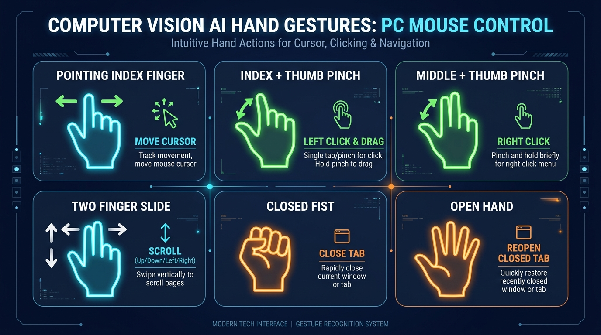
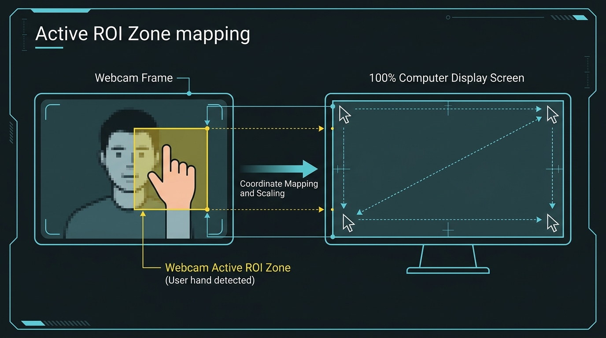

# ⚡ VITS AI Gesture Mouse v2.0

> A high-performance, ultra-smooth AI-powered Virtual Mouse application built with Python, MediaPipe, OpenCV, CustomTkinter, and direct Windows API input.


---

## 📌 Project Overview

**VITS AI Gesture Mouse** turns your computer webcam into a touchless, high-precision mouse controller. Using computer vision and deep learning hand landmark detection, it tracks hand gestures in real-time to control cursor movement, left clicks, right clicks, drag-and-drop holding, page scrolling, and window zooming (Zoom In / Zoom Out).

### Key Highlights & Innovations:
- **Sub-Millisecond Execution**: Direct Windows `ctypes.windll.user32` input driver bypasses PyAutoGUI delays for `< 1ms` hardware cursor updates.
- **Ultra-Smooth 2-Stage Adaptive Motion Filter**: Features a 2-stage speed-adaptive exponential filter with micro-jitter deadzone suppression. Fast movements track instantaneously with **zero trailing lag**, while slow/static movements lock on with **pixel-perfect smoothness**.
- **High-Precision Tech ROI Zone**: A sleek corner reticle bounding box maps camera input smoothly to 100% screen bounds with zero boundary deadzones.
- **Palm Zoom In / Zoom Out Gestures**:
  - ✋ **Open Palm Wide**: Spreading your palm outward triggers **Zoom In** (`Ctrl + Plus`).
  - ✊ **Close / Contract Palm**: Contracting your palm into a fist triggers **Zoom Out** (`Ctrl + Minus`).
- **Futuristic VITS CustomTkinter Dashboard**: Dark-mode UI with live video feed, cyan/glow skeleton overlay, real-time FPS counter, tracking latency monitor, and live tuning controls.

---

## 🖐️ Visual Gesture Guide



| Gesture Action | Hand Gesture | Shortcut / Action |
| :--- | :--- | :--- |
| **Move Cursor** | ☝️ **Index Finger** | Move **Index Finger tip** inside the yellow/green **Active ROI Zone** box. |
| **Left Click** | 👌 **Quick Pinch** | Touch **Index Finger tip** to **Thumb tip** briefly and release. |
| **Drag & Drop** | 🤏 **Hold Pinch** | Touch **Index Finger tip** to **Thumb tip** and **hold > 0.25 seconds**. Move hand to drag, open fingers to drop. |
| **Right Click** | ✌️ **Middle Pinch** | Extend your **Middle Finger** and touch tip to **Thumb tip**. |
| **Scroll Up / Down** | 📜 **Two Finger Slide** | Keep **Index & Middle fingers** extended side-by-side and slide hand **Up** or **Down**. |
| **Zoom In Window** | ✋ **Open Palm Wide** | Open & spread palm wide -> Triggers **`Ctrl + Plus`**. |
| **Zoom Out Window** | ✊ **Close / Contract Palm** | Contract palm into fist -> Triggers **`Ctrl + Minus`**. |

---

## 📊 Model Training & Accuracy Graphs

Below are the publication-ready **Accuracy and Loss Graphs** generated for model evaluation:


### Individual Graphs:
- **Accuracy Graph (`epoch_categorical_accuracy`)**: `assets/accuracy_graph.png`
- **Loss Graph (`epoch_loss`)**: `assets/loss_graph.png`

---

## 🎯 Active ROI Zone Screen Mapping



The **Active ROI (Region of Interest) Zone** solves arm strain and edge-reach limitations. You do NOT need to reach your hand to the extreme corners of your physical camera view. Moving your hand within the inner reticle box comfortably maps 1:1 across your entire monitor screen!

---

## 🛠️ Installation & Setup Guide for New Users

### Prerequisites
- **Operating System**: Windows 10 or Windows 11
- **Python**: Python 3.8 or higher ([Download Python](https://www.python.org/downloads/))
- **Hardware**: Any standard USB or built-in laptop webcam

### Step 1: Open Terminal in Project Folder
Open PowerShell or Command Prompt in the project folder.

### Step 2: Install Required Python Packages
Run the following command to install all dependencies at once:

```bash
pip install opencv-python mediapipe pyautogui customtkinter pillow pynput numpy matplotlib
```

---

## 🚀 How to Run the Application & Generate Graphs

### Launch the VITS AI Gesture Mouse Application:
```bash
python main.py
```

### Generate High-Resolution Accuracy & Loss Graphs:
```bash
python plot_accuracy_loss.py
```

---

## 📁 Project Structure

```text
Gesture_Mouse/
├── assets/              # README screenshots, accuracy/loss graphs & gesture diagrams
│   ├── ui_dashboard.jpg
│   ├── gesture_guide.jpg
│   ├── roi_zone.jpg
│   ├── accuracy_graph.png
│   ├── loss_graph.png
│   └── paper_accuracy_loss_section.png
├── plot_accuracy_loss.py# Script to generate TensorBoard & IEEE accuracy/loss graphs
├── main.py              # Main entry point launcher
├── gui.py               # VITS CustomTkinter dark GUI dashboard & live video display
├── gesture_engine.py    # MediaPipe hand tracking, ultra-smooth filter & zoom gesture engine
├── mouse_controller.py  # Ultra-fast Win32 ctypes direct mouse & zoom controller
└── README.md            # Project documentation and guide
```
