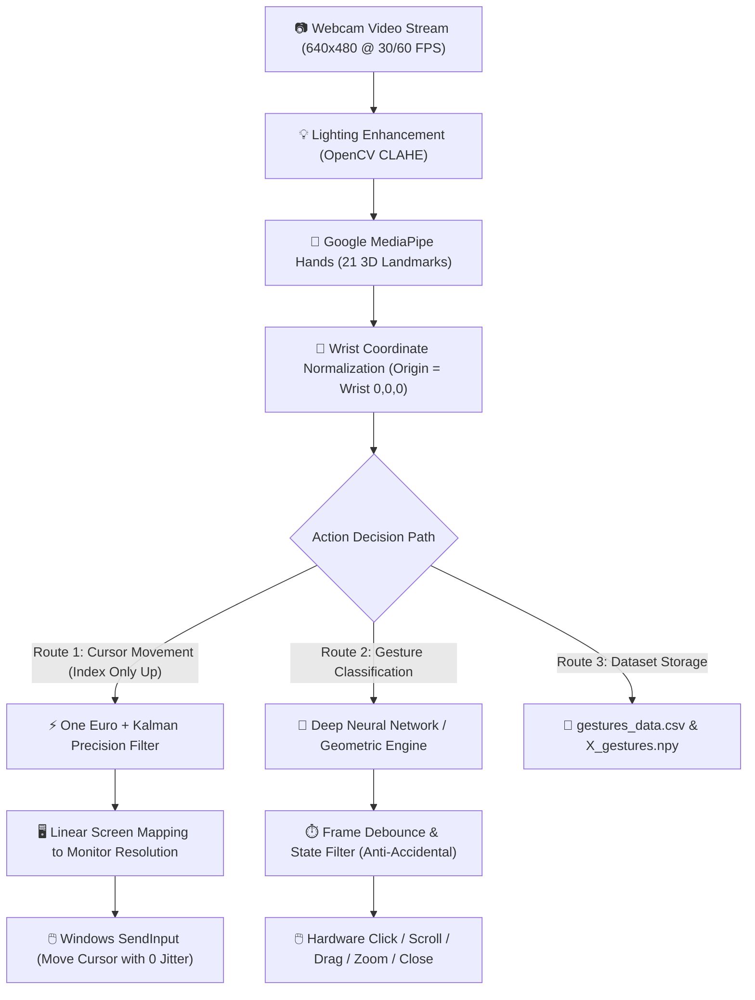

# 🖱️ AI Gesture Mouse — Complete Beginner-Friendly Project Documentation

---

## 📖 Table of Contents
1. [Project Overview (In Simple Terms)](#1-project-overview-in-simple-terms)
2. [Technologies Used](#2-technologies-used)
3. [Gesture Signs Guide (Hand Poses & Actions)](#3-gesture-signs-guide-hand-poses--actions)
4. [Workflow Diagram (Simple Block Architecture)](#4-workflow-diagram-simple-block-architecture)
5. [How Hand Gestures Are Captured (Coordinate System & Abbreviations)](#5-how-hand-gestures-are-captured)
6. [Mathematical Formulas & Calculations](#6-mathematical-formulas--calculations)
7. [Where to See Gesture Values & Outputs](#7-where-to-see-gesture-values--outputs)
8. [Commands to Perform Operations](#8-commands-to-perform-operations)
9. [Codebase Architecture & File Responsibilities](#9-codebase-architecture--file-responsibilities)

---

## 1. Project Overview (In Simple Terms)

### What is this project?
The **AI Gesture Mouse** is an intelligent, touch-free computer mouse that allows you to control your Windows PC using only your **hand in front of your webcam**. You do not need any physical mouse, special gloves, or external sensors.

### How does it feel to use?
* Point your **index finger** in the air $\rightarrow$ the mouse cursor follows your finger smoothly on the screen.
* Make a **peace sign** $\rightarrow$ it performs a **Left Click**.
* Make an **"L" shape** (thumb and index out) $\rightarrow$ it performs a **Right Click**.
* **Pinch** thumb and index together $\rightarrow$ it picks up windows, icons, or files for **Drag & Drop**.
* Show an **open palm** and move up/down $\rightarrow$ it **scrolls** your web browser or document.
* Make a **rock sign** (🤘) and move up/down $\rightarrow$ it **zooms in or out**.
* Extend your **pinky finger** $\rightarrow$ it **closes the current window** (`Alt + F4`).

---

## 2. Technologies Used

| Technology / Library | Purpose in this Project | Why It Was Chosen |
| :--- | :--- | :--- |
| **Python 3.12** | Core Programming Language | Clean syntax, fast prototyping, rich AI ecosystem. |
| **Google MediaPipe** | Hand Tracking & Joint Estimation | Detects 21 3D hand keypoints in real time with high accuracy at 60+ FPS. |
| **OpenCV (`cv2`)** | Webcam Video Streaming & Image Processing | Grabs webcam frames, flips mirror image, applies CLAHE light enhancement. |
| **TensorFlow / Keras** | Deep Learning Classifier (MLP Neural Network)| 4-layer Dense Neural Network classifying raw landmark numbers into gestures. |
| **NumPy** | High-Performance Matrix Math | Fast array vector math, distance calculations, coordinate normalization. |
| **Pandas** | Data Management & CSV Handling | Exports, labels, and inspects gesture datasets with readable headers. |
| **Windows `SendInput` (ctypes)**| Kernel-Level Mouse & Keyboard Emulation | Hardware-level clicks and movements with zero lag (much faster than PyAutoGUI). |
| **UIAutomation (`uiautomation`)**| Smart UI Element Inspection | Inspects buttons and links under cursor for accessibility auto-hover clicking. |
| **CustomTkinter** | Modern Dark-Themed GUI Dashboard | Clean visual desktop interface to toggle features, calibrate, and view camera feed. |
| **Matplotlib** | Training & Similarity Graphing | Generates accuracy/loss curves and real-time live gesture similarity charts. |

---

## 3. Gesture Signs Guide (Hand Poses & Actions)

| ID | Gesture Name | Hand Pose Sign | Physical Finger Position | Computer Action Performed |
| :---: | :--- | :---: | :--- | :--- |
| **0** | **Move Cursor** | ☝️ | **Index Finger ONLY** extended; all other fingers folded. | Moves mouse cursor smoothly across screen. |
| **1** | **Drag & Drop** | 🤏 | **Index + Thumb Pinching** together (< 40px distance). | Holds down left mouse button to drag; open hand drops. |
| **2** | **Left Click** | ✌️ | **Peace Sign**: Index + Middle extended, others folded. | Clicks left mouse button once. |
| **3** | **Right Click** | 👆 / 👉 | **L-Shape / Gun**: Thumb out sideways, Index pointing up. | Opens right-click context menu. |
| **4** | **Double Click** | 👍 | **Thumb Only**: Thumb extended upward, other 4 folded. | Double-clicks to open files/folders. |
| **5** | **Scroll** | 🖐️ | **Open Palm**: All 5 fingers extended; move hand UP/DOWN. | Scrolls web pages or documents up/down. |
| **6** | **Zoom** | 🤘 | **Rock Sign**: Index & Pinky extended; move hand UP/DOWN. | Zooms in (`Ctrl + +`) or Zooms out (`Ctrl + -`). |
| **7** | **Close Window** | 🤙 | **Pinky Extended** (Shaka sign) held for 0.3 seconds. | Sends `Alt + F4` to close the active application. |
| **8** | **Idle** | ✊ | **Closed Fist**: All fingers tucked in. | Pauses all mouse actions (safe resting position). |

---

## 4. Workflow Diagram (Simple Block Architecture)



---

## 5. How Hand Gestures Are Captured

### The 21 Hand Landmarks
MediaPipe tracks **21 key points** on the human hand. Each point has 3 coordinates: **$(x, y, z)$**.
$21 \text{ landmarks} \times 3 \text{ coordinates} = \mathbf{63 \text{ feature values per frame}}$.

```
          [8: Index Tip]     [12: Middle Tip]   [16: Ring Tip]
                |                    |                  |
          [7: Index DIP]     [11: Middle DIP]   [15: Ring DIP]     [20: Pinky Tip]
                |                    |                  |                 |
          [6: Index PIP]     [10: Middle PIP]   [14: Ring PIP]     [19: Pinky DIP]
                |                    |                  |                 |
  [4: Thumb Tip]|                    |                  |          [18: Pinky PIP]
        |       [5: Index MCP]     [9: Middle MCP]    [13: Ring MCP]      |
  [3: Thumb IP]         \                  |                  /           [17: Pinky MCP]
        |                \                 |                 /                   |
  [2: Thumb MCP]          --------------------------------------------------------
        |                                        |
  [1: Thumb CMC]                                 |
        \                                       /
         ------------------- [0: Wrist] ---------
```

### Explanation of Heading Abbreviations
When looking at column headings in `dataset/gestures_data.csv`:

* **`lm`**: **Landmark** (e.g., `lm0` = Landmark 0, `lm4` = Landmark 4).
* **`cmc`**: **Carpometacarpal joint** (the base joint of thumb near wrist).
* **`mcp`**: **Metacarpophalangeal joint** (the base knuckles where fingers connect to palm).
* **`ip`**: **Interphalangeal joint** (the middle hinge joint of thumb).
* **`pip`**: **Proximal Interphalangeal joint** (the lower middle knuckle of fingers).
* **`dip`**: **Distal Interphalangeal joint** (the upper knuckle right below fingernail).
* **`tip`**: **Fingertip** (the tip of finger or thumb).
* **`_x`**: Horizontal distance from wrist (negative = left, positive = right).
* **`_y`**: Vertical height from wrist (negative = pointing **upward**, positive = downward).
* **`_z`**: Depth distance relative to camera plane.

---

## 6. Mathematical Formulas & Calculations

### Formula 1: Wrist-Relative Coordinate Normalization
To make gesture recognition work regardless of where your hand is positioned in the camera frame, all landmark positions are subtracted from the **Wrist (Landmark 0)**:
$$x_{norm} = x_{lm} - x_{wrist}, \quad y_{norm} = y_{lm} - y_{wrist}, \quad z_{norm} = z_{lm} - z_{wrist}$$
* *Result:* The wrist is always $(0, 0, 0)$. Moving your whole arm does not distort the gesture geometry!

### Formula 2: Euclidean Distance (Pinch Detection for Drag & Drop)
To measure if your thumb and index fingertips are touching:
$$\text{Distance} = \sqrt{(x_{index\_tip} - x_{thumb\_tip})^2 + (y_{index\_tip} - y_{thumb\_tip})^2}$$
* If $\text{Distance} < 35\text{ pixels}$, a **Pinch** is registered.

### Formula 3: Finger Extension Ratio
To determine whether a finger is extended straight or curled into the palm:
$$\text{Extension Ratio} = \frac{\text{Distance}(\text{Fingertip}, \text{Wrist})}{\text{Distance}(\text{Base Knuckle MCP}, \text{Wrist})}$$
* If $\text{Extension Ratio} > 1.45$: Finger is **Extended** (straight).
* If $\text{Extension Ratio} < 1.05$: Finger is **Folded** (curled into palm).

### Formula 4: Screen Coordinate Interpolation (Moving the Cursor)
Maps index fingertip from camera space ($640 \times 480$) to your screen monitor resolution ($W_{screen} \times H_{screen}$):
$$X_{screen} = \left(\frac{X_{finger} - X_{min}}{X_{max} - X_{min}}\right) \times W_{screen}$$
$$Y_{screen} = \left(\frac{Y_{finger} - Y_{min}}{Y_{max} - Y_{min}}\right) \times H_{screen}$$

### Formula 5: One Euro Speed-Adaptive Smoothing Filter
Eliminates hand tremor when still while giving instant response when moving fast:
$$\alpha = \frac{1}{1 + \frac{\tau}{T_e}}, \quad \text{where } \tau = \frac{1}{2\pi (f_{min} + \beta |\dot{x}|)}$$
* When moving slowly $\rightarrow$ cutoff is low $\rightarrow$ heavy smoothing (zero jitter).
* When moving quickly $\rightarrow$ cutoff is high $\rightarrow$ zero smoothing delay (instant responsiveness).

---

## 7. Where to See Gesture Values & Outputs

1. **Full Labeled Dataset File**:
   * Path: \dataset/gestures_data.csv   * Open in Microsoft Excel, VS Code, or Notepad. Every row shows \gesture_id\, \gesture_name\, and all 63 coordinates.
2. **Gesture Template Averages (Summary Reference)**:
   * Path: \dataset/gesture_averages_reference.csv   * Shows a 9-row table containing the exact average mathematical template for every gesture.
3. **Live Testing Window with Match Bars**:
   * Run \python gestures/live_test_graph.py   * Shows live webcam feed alongside a real-time bar graph displaying the percentage match (0–100%) for all 9 gestures simultaneously.
4. **Accuracy and Loss Graphs**:
   * Paths: esults/plots/accuracy_graph.png\ and esults/plots/loss_graph.png\.
5. **Project Reports & Presentations**:
   * Directory: esults/documents/\ (Full Word Documentation, PPT slides, and presentation guides).

---

## 8. Commands to Perform Operations

| Action | Command Line Terminal Syntax | What It Does |
| :--- | :--- | :--- |
| **Launch Full Mouse Application** | \python main.py\ | Opens the modern GUI dashboard and starts touchless mouse control. |
| **Record New Dataset from Scratch** | \python gestures/train_gesture_model.py --collect\ | Opens webcam to record samples for all 9 gesture classes (keys 0–8). |
| **Replace a Specific Gesture** | \python gestures/train_gesture_model.py --replace-gesture 3\ | Re-records ONLY Gesture 3 (Right Click) with webcam and updates dataset. |
| **Sync Dataset After Editing CSV** | \python gestures/train_gesture_model.py --from-csv\ | Loads edited \gestures_data.csv\ and updates model arrays. |
| **Re-Train AI Neural Network** | \python gestures/train_gesture_model.py --train\ | Trains Deep Neural Network on dataset and saves \gestures/gesture_model.h5\. |
| **Launch Live Gesture Match Meter** | \python gestures/live_test_graph.py\ | Opens camera with real-time percentage matching bars for each gesture. |
| **Generate Accuracy/Loss Graphs** | \python scripts/plot_accuracy_loss.py\ | Generates publication-ready training accuracy and loss curves into esults/plots/\. |
| **Generate Progress & Evolution Charts** | \python scripts/plot_daily_progress_graph.py\ | Generates 4-panel evolution charts into esults/plots/\. |
| **Generate Similarity Match Chart** | \python scripts/plot_simple_similarity.py\ | Generates live similarity bar chart into esults/plots/\. |
| **Compile Full Word Documentation** | \python scripts/build_full_project_word_doc.py\ | Generates formatted docx file into esults/documents/\. |
| **Generate PowerPoint Presentation** | \python scripts/generate_powerpoint_presentation.py\ | Generates presentation slides into esults/documents/\. |

---

## 9. Codebase Architecture & File Responsibilities

* **\main.py\**: Root entry point; configures sys.path and boots the \ModernGestureGUI\.
* **\gestures/\**: Gesture recognition, tracking engine, controller, and models:
  * **\gesture_engine.py\**: High-performance core engine; handles MediaPipe landmark extraction, One Euro filtering, template matching, and gesture debounce.
  * **\mouse_controller.py\**: Low-latency Windows \SendInput\ ctypes interface for hardware-level clicks, cursor motion, and dragging.
  * **\	rain_gesture_model.py\**: Dataset collection, gesture replacement CLI, CSV synchronization, and Deep Neural Network model training.
  * **\live_test_graph.py\**: Interactive live testing visualization showing real-time similarity to gesture templates.
  * **\gesture_model.h5\**: Trained Deep Neural Network weights.
* **\gui/\**:
  * **\gui.py\**: CustomTkinter visual dashboard interface with toggle switches, sensitivity sliders, and live camera display.
* **\dataset/\**: Contains raw matrices (\X_gestures.npy\, \y_gestures.npy\), training history (\	raining_history.npy\), labeled CSV (\gestures_data.csv\), and gesture templates (\gesture_averages_reference.csv\).
* **esults/\**: All output results files:
  * **\plots/\**: Output accuracy/loss curves, daily progress charts, and similarity plots.
  * **\documents/\**: Output \.docx\ technical documentation and \.pptx\ presentations.
* **\scripts/\**: Utility tools for plotting evaluation curves, generating presentations, and compiling documentation.
* **\ssets/\**: Static image assets including UI screenshots and gesture posters.
* **\docs/\**: Markdown project documentation and technical references.
